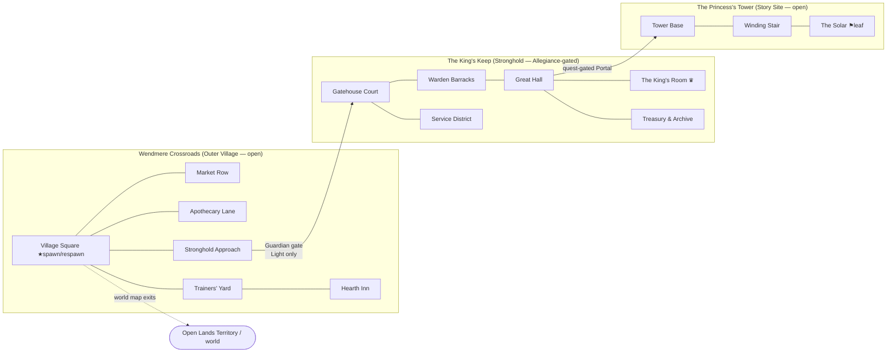

# Home-town maps

## Context

A new Hero should begin life somewhere that *belongs* to them. Onboarding
(DESIGN-0006) already binds every Hero to a lineage-derived **Homeland**, and
the world map (DESIGN-0010) gives each of the eight Homelands an **Outer
Village** and a **Stronghold** (DESIGN-0009). But three things are unresolved
and block a playable "start at home" loop:

1. **Where a Hero first spawns.** DESIGN-0006 drops the created Hero into the
   combat arena and explicitly asks whether a Homeland is "one Zone, a family of
   Zones, or a starting region."
2. **What services a town actually offers.** The only economy primitive today is
   the player-driven **Exchange** and its **Exchange Brokers** (DESIGN-0009). No
   weapon / armor / potion vendors, and no potions, exist yet.
3. **What the towns contain and look like** — sub-maps, NPCs, and art direction.

This record designs the **home town** for each Lineage: a hub of connected Zones
(Outer Village → Stronghold → a signature Story Site), the NPCs in them, how a
Hero moves between them, and art-generation prompts per map. It resolves the
spawn question (a Hero spawns in their Lineage's Outer Village) and proposes the
NPC service layer and a starter consumable set.

**Canon vs. new.** Established by existing records and reused verbatim:
Stronghold / Outer Village / Stronghold Guardian, Allegiance-gated access,
5–10 Stronghold Zones, the walk-through Portal graph, Exchange Brokers, the
culmination-hall examples, the six Combat Classes, the equipment tiers, and the
creature roster. **New proposals in this record** (flagged ⊕ throughout): the
first-spawn location, named towns and Story Sites, fixed-price NPC shops, the
starter **Provision** (consumable) set, class-trainer NPCs, and the Human
narrative (the King's Keep and the Princess's Tower).

## The home-town model

A **home town** is not one map. It is a small cluster of Zones inside a Homeland
Territory, in three concentric rings, connected only by Portals the Hero walks
through (DESIGN-0010 — no fast travel):

```
        OUTER VILLAGE (shared, both Allegiances)        STRONGHOLD (Allegiance-gated)      STORY SITE
        ┌───────────────────────────────────┐          ┌────────────────────────────┐     ┌──────────────┐
 spawn ▶│ Village Square ⇄ Market Row        │          │ Gatehouse Court ⇄ Guard Hall│     │ signature     │
        │      ⇕            ⇕                 │  Guardian│      ⇕           ⇕          │     │ multi-zone    │
        │ Trainers' Yard ⇄ Apothecary Lane   │──gate──▶ │ Service District ⇄ Great Hall│──▶ │ questline     │
        │      ⇕                              │  (⊕ deny │      ⇕                      │     │ (King's Keep, │
        │ Hearth Inn ─ Stronghold Approach ──┘  opposing)│ Culmination Hall ─ Treasury │     │  Tower, …)    │
        └───────────────────────────────────┘          └────────────────────────────┘     └──────────────┘
```

- **Ring 1 — Outer Village** (open to Light and Dark). The social hub and the
  spawn ring. Contains the market, apothecary, trainers, inn, and the Exchange
  Broker. Themed per Lineage (DESIGN-0009 "Stronghold and village themes").
- **Ring 2 — Stronghold** (Allegiance-gated). 5–10 Zones (DESIGN-0010) reached
  through the **Stronghold Approach → Guardian gate**. Same-Allegiance Heroes
  pass; Opposing-Allegiance Heroes are warned and repelled by the **Stronghold
  Guardian** (DESIGN-0009 escalation ladder). Culminates in a hall that fits the
  culture (King's Room, Council Grove, Tide Chamber, Forge Seat, Hearth Hall…).
- **Ring 3 — Story Site** (⊕). A signature multi-Zone questline hanging off the
  Stronghold or Village by a Portal — the "named" landmark of each people. Every
  leaf Zone keeps a return Portal (DESIGN-0010).

Zone budget per home town: **~4 Village Zones + 5–8 Stronghold Zones + 2–4 Story
Zones ≈ 11–16 Zones**, comfortably inside each Homeland's 30–45-Zone allowance
(DESIGN-0010).

### Movement & interaction rules
- **Spawn (⊕):** a freshly created or logging-in Hero appears at their Lineage's
  **Village Square**. This makes each Homeland the Hero's "starting region,"
  answering DESIGN-0006's open question.
- **Traversal:** left/right through Portals only; the current networked build
  already models zones + positional Portals (see *Implementation*).
- **Allegiance gate (⊕ enforcement detail):** the Portal from *Stronghold
  Approach* into *Gatehouse Court* is a server-checked boundary. Opposing
  Allegiance is refused (Guardian warns → repels → defeat returns them to the
  Village Square, never inside). Outer Village and Story Sites are open to both.
- **Respawn / home point (⊕):** the **Hearth Inn** is the Hero's respawn anchor;
  defeat in or near the town returns them there (a "legal nearby location",
  DESIGN-0009).
- **Safety:** Outer Villages are proposed as **guarded peace zones** — no Open
  Conflict, Sentry NPCs present (DESIGN-0009 leaves this open; this record picks
  the peaceful reading for the starter experience).
- **Map:** `M` opens the world/region map (DESIGN-0010); the home town shows as
  one Outer-Village marker + one Stronghold marker that expands into this Zone
  graph.

## Standard NPC roster (the "town template")

NPCs are **Characters** (DESIGN glossary), server-owned, non-hostile inside the
peace zone. Every home town instantiates this template; flavor/skins vary by
Lineage. (Shops and the Provision set are ⊕ new; Exchange Broker is canon.)

| Role | Zone | Function |
| --- | --- | --- |
| **Stronghold Guardian** (canon) | Stronghold Approach | Enforces the Allegiance boundary; the gate's set-piece Character. |
| **Gate Sentries** (⊕) | Village Square, Approach | Flavor guards; give directions; signal the peace zone. |
| **Weaponsmith** (⊕) | Market Row | Sells Tier 1–2 weapons of every family (Roadworn Blade, Old Iron Greatblade, Ashwood Spear, Crankwood Crossbow, Moonwood Bow, Driftwood Buckler, Wayfarer's Dirk, Quarry Maul…). Buys back loot. |
| **Armorer** (⊕) | Market Row | Sells Tier 1–2 Class armor pieces (the six-slot sets, e.g. Roadwarden / Candlewick lines) and generic **Capes**. |
| **Wandwright / Arcane Stall** (⊕) | Market Row | Wands & Staves (Hazel Sparkwand, Lantern Staff) and reagents — the arcane focus vendor split out from the Weaponsmith. |
| **Apothecary** (⊕) | Apothecary Lane | Sells **Provisions** (see below): healing salves, vigor & focus draughts, antidotes. |
| **Provisioner / Grocer** (⊕) | Apothecary Lane | Food/utility: waybread (out-of-combat regen), torches, throwables, ropes. |
| **Exchange Broker** (canon) | Village Square | Access point to the server-wide player market (buy/sell orders, escrow). |
| **Class Trainers ×6** (⊕) | Trainers' Yard | One each for Vanguard, Ravager, Ranger, Duelist, Arcanist, Warden. Teach baseline Class actions and the three talent branches (DESIGN-0012/0013). |
| **Innkeeper** (⊕) | Hearth Inn | Sets the respawn anchor; rest; opens Hero overview panel. |
| **Quartermaster** (⊕) | Hearth Inn | Placeholder for future durable stash / bank. |
| **Lorekeeper / Herald** (⊕) | Village Square / Stronghold | Quest-giver that opens the Story Site line. |
| **Benevolent wildlife** (canon roster) | ambient | Homeland-specific creatures wandering as life/set-dressing (e.g. Meadow Puffkin, Lumen Mole). |

### ⊕ Provision set (new consumables — none exist in canon yet)
A deliberately tiny starter line, priced beneath the player Exchange so towns are
useful on day one without undercutting player trade:

| Provision | Effect | Sold by |
| --- | --- | --- |
| **Mending Salve** | Restore health over a few seconds, out of combat | Apothecary |
| **Draught of Vigor** | Restore stamina | Apothecary |
| **Focusing Tonic** | Restore mana | Apothecary |
| **Antidote / Warmth Tallow / Cooling Salt** | Cure a biome status (poison / cold / heat) | Apothecary (biome-flavored) |
| **Waybread** | Faster out-of-combat regen for a while | Provisioner |

### Shop interaction model (⊕)
NPC shops are a thin, server-authoritative convenience layer, **not** the
Exchange: walking into an NPC's interact radius shows a prompt; interacting opens
a client panel (reuse the existing `chronicle_character_panels` window style);
purchases are validated server-side against the Hero's currency and a fixed price
list. This depends on the same durable server-owned inventory/currency the
Exchange needs (DESIGN-0009) — until that lands, shops are display-only mockups.

## The eight home towns

Each entry: **Homeland (Allegiance)** · Outer Village · Stronghold → culmination
hall · signature Story Site · a distinctive sub-map · signature Guardian ·
local wildlife (from the DESIGN-0011 roster) · palette/materials (DESIGN-0008).
All proper names are ⊕ new unless a doc named them.

### 1. Humans — Open Lands (Light) — *worked example*
- **Outer Village — Wendmere Crossroads.** A road-linked market town: caravan
  yard, inn, workshops, farm terraces (DESIGN-0009 Human theme). Zones: Village
  Square (spawn) · Market Row · Apothecary Lane · Trainers' Yard & Hearth Inn.
- **Stronghold — the King's Keep** (5–8 Zones): Gatehouse Court → Warden Barracks
  (guard hall) → Service District (kitchens/smithy) → the Great Hall → **the
  King's Room** (culmination, DESIGN-0009's own example) → Treasury & Archive.
  Layered walls, banners, a central hall; platforms are bridges, rooftops,
  ruined walls, terraced farmland.
- **Story Site — the Princess's Tower** (⊕, 3 Zones): a warden-tower on the keep's
  edge — Tower Base (locked Portal, quest-gated) → Winding Stair → the Solar
  (leaf, return Portal). Seed line: the heir-warden has sealed herself in to
  contain something in the Archive; the Lorekeeper sends the Hero up.
- **Distinctive sub-map:** the *Terraced Farmland* approach — a gentle side-scroll
  of orchard terraces and old roads that teaches movement before the town.
- **Guardian:** the **Waystone Guardian** / **Old Road Warden** constructs
  (canon benevolent Open-Lands constructs read perfectly as keep sentinels).
- **Wildlife:** Meadow Puffkin (healing grazer), Brookskip Otter; a **Hillkeep
  Gargoyle** (Corrupted) menaces the keep's outer wall as an early threat.
- **Palette/materials:** royal blue, warm ivory, field green, oxblood, muted
  gold; linen, wool, oak, hammered brass, weathered steel, glazed pottery.

### 2. Tidekin — The Sea (Light)
- **Outer Village — Tidewharf.** Amphibious docks and tidal-terrace market reached
  through tidal gates. Buildings change function as the water rises.
- **Stronghold — the Pearl Citadel** → **the Tide Chamber** (culmination,
  DESIGN-0009 example). Coral-and-shell citadel behind tidal gates; flooded halls,
  coral arches, wave-worn shrines.
- **Story Site — the Sunken Shrine** (⊕): a flooded cathedral whose rooms open and
  close with the tide; timing-based traversal.
- **Guardian:** a bonded **Reefsong Whalelet**-scaled guardian + tidal-gate
  mechanism (environmental defense).
- **Wildlife:** Ripplefin Sprout, Shellbell Nymph (bubble shield), Tidepool
  Crowncrab; Tidal Gate Eel lurks past the gate.
- **Palette/materials:** deep teal, sea green, foam cream, indigo, coral-orange
  accents; shell, polished coral, pearl, woven kelp, sea glass, verdigris bronze.

### 3. Grove Centaurs — Elder Forests (Light)
- **Outer Village — Rootway Commons.** Broad living paths and canopy roads into
  the grove; settlements built *around* living trunks. Mind the longer body when
  spacing platforms (DESIGN-0008 note).
- **Stronghold — the Heartgrove** → **the Council Grove** (culmination,
  DESIGN-0009 example). Enclosed by ancient roots and guarded forest paths.
- **Story Site — the Elder Tree: Trial of Paths** (⊕): a vertical climb of root
  bridges and hollow trunks to a luminous clearing.
- **Guardian:** the **Elderbloom Dryad** (canon Elite) — heals allies while the
  Hero protects its roots; here it warands the grove boundary.
- **Wildlife:** Acornback Fawn, Lantern Antler (reveals herbs), Rootling Tender;
  Briarhorn Boar and Hollowroot Mimic off the paths.
- **Palette/materials:** moss, fern, bark brown, warm cream, amber & spring-green
  accents; living wood, bark lamellae, woven reeds, bronze, amber, seed pods.

### 4. Aeralith — Sky Reaches (Light)
- **Outer Village — Lowdock.** Lower sky docks and controlled lifts; rope bridges
  between wind-carved spires. Platforms suggest updrafts and dangerous open air.
- **Stronghold — Skyspire Aerie** → **the Windcourt** (⊕ culmination). A high
  sky-spire reached by lifts, bridges, and wind passages.
- **Story Site — the Observatory of Storms** (⊕): astronomer's spire with hanging
  bells and wind-harp puzzles; gliding traversal between mesas.
- **Guardian:** a **Liftline Drake** bound to the lift mechanism + controlled-lift
  denial (you cannot ride up on the wrong Allegiance).
- **Wildlife:** Cloudlet Finch (boosts jumping), Zephyr Manta (ferries across a
  broken bridge), Windbridge Wisp; Thunderplume Condor as a threat.
- **Palette/materials:** cloud white, azure, blue-grey, soft lavender, sunrise-gold
  accents; layered silk, lacquered light wood, brass, pale stone, crystal,
  taut membrane. Motifs: spirals, kites, wind harps, open arches.

### 5. Crag Trolls — Broken Mountains (Dark)
- **Outer Village — Hoistyard.** Quarry terraces, rope-hoist yards, forge markets,
  cliffside lodgings below monumental gates.
- **Stronghold — Stormgate Hold** → **the Forge Seat** (culmination, DESIGN-0009
  example). Monumental mountain hold behind storm-battered gates; platforms look
  split, stacked, anchored, weight-bearing.
- **Story Site — the Storm Forge & Avalanche Stair** (⊕): ascend monumental stairs
  through avalanche chutes to a storm-fed forge.
- **Guardian:** a **Thunderquarry Golem** (canon Elite) standing the gate.
- **Wildlife:** Pebblehorn Kid (warns of rockfall), Quarryback Ram; Slatejaw Hound,
  Stormcap Golem as threats.
- **Palette/materials:** granite blue, charcoal, umber, storm grey, rust-orange &
  pale-lichen accents; basalt, slate, raw iron, horn, thick hide, rope,
  lichen-dyed cloth. Motifs: wedges, stacked slabs, fault lines, metal bands.

### 6. Deep Goblins — The Underdeep (Dark)
- **Outer Village — Lampcap Junction.** Trade tunnels and guarded surface
  elevators; dense stacked settlement of pumps, chain lifts, rails, ventilation
  towers. (The prototype's **Buttoncap Biter** is the local level-1 pest — a
  direct tie to the existing build.)
- **Stronghold — the Deepworks Nexus** → **the Great Gearworks Assembly**
  (⊕ culmination). A fortified nexus controlling tunnels, rails, and ventilation.
- **Story Site — the Crystal Seam / Runaway Rail** (⊕): a minecart descent through
  crystal seams and machine halls.
- **Guardian:** a **Ventshade** (canon Corrupted) + sealed ventilation doors as
  the boundary mechanism.
- **Wildlife:** Lumen Mole (lights mining nodes, benevolent); Rail Gnawer,
  Sporebelly Hopper, Gearspine Rat as pests.
- **Palette/materials:** soot black, copper, umber, fungus violet, chartreuse/cyan
  bioluminescence; sooted iron, copper, leather, fungal fiber, glass, ceramic
  pipe, crystal. Motifs: diamonds, tunnel ribs, rivets, rails, mycelial nets.

### 7. Sunscour — Ember Desert (Dark)
- **Outer Village — the Caravanserai.** Caravan village and cistern market before
  a shaded bastion; cloth shade, scaffolds, heat-distorted ruins.
- **Stronghold — the Shade Bastion** → **the Legion Court** (⊕ culmination — the
  **Sunscour Legion** is the one canon-named organization; its war-council fits a
  Dark, disciplined culture better than a "king"). Built around protected water
  and route control.
- **Story Site — the Solar Furnace & Mirage Aqueduct** (⊕): monumental aqueduct
  traverse to a solar furnace; heat-shimmer illusions hide platforms.
- **Guardian:** Legion sentinels + a **Cistern Devourer** (canon Elite) guarding
  the water the bastion is built around.
- **Wildlife:** Cistern Gecko (cleans tainted water, grants heat resistance —
  benevolent); Saltback Jackal (howls for its pack); Mirage Viper as a threat.
- **Palette/materials:** sand, indigo, ember red, charcoal, turquoise/brass
  accents; sun-bleached linen, dark cooling cloth, blackened bronze, glazed
  ceramic, salt crystal, colored glass. Motifs: split sun, horizon line, mirage
  wave, geometric shade screens, water tallies.

### 8. Rimeborn — The Ice Lands (Dark)
- **Outer Village — Thawcamp.** A thermal village of mobile windbreak shelters
  outside insulated halls, clustered around geothermal warmth ("enclosed circles
  of warmth"). The most predator-pressured town — the Ice biome's creatures are
  all Elite (DESIGN-0011).
- **Stronghold — the Aurora Hall** → **the Hearth Hall** (culmination, DESIGN-0009
  example). Insulated ice hold around geothermal warmth and aurora-lit halls.
- **Story Site — the Snow-buried Ruin / Aurora Vault** (⊕): dig-and-descend through
  a buried ruin toward an aurora-lit vault; heat management as a mechanic.
- **Guardian:** a **Steamhide Ursa** or **Aurora Hornbeast** (canon Elites) bonded
  to the hearth-gate.
- **Wildlife:** few benevolent — set-dress with distant Aurora Lynx and a tame
  hearth-beast; the **Nightglass Mammoth** (Corrupted Elite, cleansable) as a
  story threat rather than a farm target.
- **Palette/materials:** midnight navy, glacial blue, moon white, black rock,
  aurora-green/magenta & hearth-amber accents; layered fur, felt, bone, dark iron,
  sealable leather, ice glass, luminous mineral pigment. Motifs: hexagonal
  fracture, spear points, braided cord, constellations, circles of warmth.

## Portal graph (human home town, representative)



Every Zone has ≥1 outbound Portal; leaf Zones (King's Room, the Solar) keep a
return Portal (DESIGN-0010). Other Lineages follow the same three-ring shape with
their own Zone names.

## Art-generation prompts

**Shared style preamble** (prepend to every prompt; from DESIGN-0008 and
`art-source/style-references/cinematic-storybook-anime-v1.png`):

> *Child-friendly cinematic storybook-anime; clean dark contours, soft
> cel-painted shading, luminous oversized nature given more space than any
> characters; a 2D side-scrolling game keyframe, 16:9, with clearly traversable
> platforms, a vertical route, foreground cover, a distant landmark, and a
> readable safe-settlement silhouette; characters compact at 3.5–4 heads tall.*

### Human home town (full set)
- **Wendmere Crossroads (village keyframe):** "…a warm crossroads market town at
  golden hour: timber-and-plaster stalls, a caravan yard with oxcarts, terraced
  farmland behind, an old stone road leading up toward a distant hill keep with
  royal-blue and muted-gold banners. Palette royal blue, warm ivory, field green,
  oxblood; materials oak, linen, hammered brass, glazed pottery."
- **The King's Keep — Gatehouse Court:** "…layered curtain walls and a raised
  central hall, banners on brass poles, a portcullis flanked by two ivy-wrapped
  stone-construct sentinels (Waystone Guardians); side-scroll platforms of
  ramparts and ruined walls; oxblood-and-gold heraldry with an original knot/road
  motif, not real-world crests."
- **The Princess's Tower — the Solar (story keyframe):** "…the top chamber of a
  slender warden-tower at dusk, tall arched windows, an astronomer's table and a
  sealed archive door edged with faint protective light; a lone heir-warden in a
  royal-blue mantle; warm ivory stone, candle glow."
- **NPC — Weaponsmith:** "…a broad-shouldered human smith in a leather apron at an
  open forge stall, racks of Tier-1 arms (Roadworn blades, Ashwood spears, a
  Driftwood buckler); brass and weathered steel; friendly weathered face."

### Marquee keyframe prompt per other Lineage
- **Tidekin — Tidewharf & Pearl Citadel:** "…a coral-and-shell citadel on tidal
  terraces reached through great tidal gates, water level mid-rise revealing
  stepping platforms; deep teal, sea green, foam cream, coral-orange accents;
  pearl, woven kelp, verdigris bronze; ripple and scale-plate motifs."
- **Grove Centaurs — the Heartgrove:** "…a settlement woven around colossal living
  trunks, root-bridge platforms and canopy roads climbing to a luminous Council
  Grove; moss, fern, bark-brown, amber and spring-green glow; leaf-vein and
  growth-ring motifs; wide horizontal composition for long-bodied residents."
- **Aeralith — Skyspire Aerie:** "…a wind-carved spire above a sea of clouds, rope
  bridges and sail-lifts between floating mesas, hanging bells and open arches;
  cloud white, azure, blue-grey, lavender, sunrise-gold; silk, pale stone,
  crystal, taut membrane; spiral and wind-harp motifs; dangerous open air below."
- **Crag Trolls — Stormgate Hold:** "…monumental basalt gates under a storm sky,
  quarry terraces and rope-hoists, split-and-stacked weight-bearing platforms,
  a storm-fed forge glowing within; granite blue, charcoal, umber, rust-orange;
  slate, raw iron, hammered metal bands; wedge and fault-line motifs."
- **Deep Goblins — Lampcap Junction:** "…a dense stacked Underdeep settlement lit
  by chartreuse and cyan bioluminescence, chain-lifts and rails and ventilation
  towers, fungal fiber and ceramic pipe; soot black, copper, umber, fungus violet;
  diamond, rivet, tunnel-rib and mycelial-net motifs; braced excavated platforms."
- **Sunscour — the Shade Bastion:** "…a shaded desert bastion over a protected
  cistern, monumental aqueduct and geometric shade screens against a low ember
  sun, caravan tents before the gates; sand, indigo, ember red, charcoal,
  turquoise/brass; blackened bronze, colored glass; split-sun and mirage-wave
  motifs; heat-shimmer air."
- **Rimeborn — Thawcamp & Aurora Hall:** "…mobile fur-and-bone windbreak shelters
  around a glowing geothermal hearth outside an insulated ice hold, aurora ribbons
  overhead, ice-glass and dark iron; midnight navy, glacial blue, moon white,
  aurora-green and hearth-amber; hexagonal-fracture, braided-cord and
  circle-of-warmth motifs; snow-buried ruin on the horizon."

### NPC prompt template (reuse per role, swap Lineage palette/materials)
> *"…a [Lineage] [role] Character in the storybook-anime style, 3.5–4 heads tall,
> readable silhouette and a single clear role prop ([anvil / mortar & pestle /
> ledger / training weapon / lantern]); [Lineage palette] clothing in [Lineage
> materials]; warm approachable expression; neutral standing pose for a
> side-scroll town."*

Priority NPC art: the six **Class Trainers** (distinct weapon silhouettes:
Vanguard shield, Ravager two-hander, Ranger bow, Duelist paired blades, Arcanist
staff, Warden polarity focus), the **Stronghold Guardian** per Lineage, and the
three shop keepers.

## Implementation mapping (onto the current build)

The networked build already has the pieces this needs (see `crates/game-domain`):
zones with fixed-point collision, positional Portals, per-zone snapshots, and
per-hero zone routing.

1. **Zones as data.** Add each home-town Zone to `catalog.rs` as `ZoneGeometry`
   (ground, one-way ledges, climbs, Portals, spawns) with a `ZoneId`. Author the
   Human town first end-to-end, then the others.
2. **Spawn per Lineage (⊕).** `World::join` currently forces `SUNLIT_FOREST`.
   Add a `lineage → home Village-Square ZoneId` table and spawn there. Carry
   `allegiance` on `HeroDescriptor` (derive from Lineage) for the gate check.
3. **Allegiance gate.** Give the Approach→Gatehouse `PortalVolume` a required
   Allegiance; on cross, if the Hero's Allegiance differs, refuse the transfer and
   emit a "repelled" event instead of `ZoneTransfer` (Guardian escalation).
4. **NPC entities.** Add `EntityKind::Npc` (a non-hostile Character with a role id
   + interact radius, no AI) to the snapshot; the client draws it and shows an
   interact prompt. Trainers/shops open client panels (reuse the
   `chronicle_character_panels` window). Guards can reuse enemy visuals but with
   hostility off.
5. **Shops & Provisions (⊕).** Gate on durable server-owned inventory/currency
   (shared dependency with the Exchange, DESIGN-0009). Until then, ship shops as
   display-only panels with the price lists above.
6. **Client presentation.** Extend `world.gd`'s `MapView` drawing + backgrounds
   per new zone; reuse the Lineage palettes for placeholder art until keyframes
   from the prompts above are produced.

## Open questions
- Is there an inner **Lineage-only** sanctuary inside a Stronghold, distinct from
  the Allegiance gate? (DESIGN-0009 open question — inherited here.)
- Are Outer Villages truly peace zones, or do they allow Open Conflict with guard
  reactions? (This record assumes peace zones for the starter loop.)
- Do NPC fixed-price shops stay long-term, or fold entirely into the Exchange once
  durable inventory exists?
- Confirm the culmination-hall names for Aeralith / Deep Goblins / Sunscour
  (Windcourt / Great Gearworks Assembly / Legion Court are ⊕ proposals).
- Naming pass: all ⊕ town and Story-Site names are placeholders pending review.

## Change log
- 2026-08-24: Initial home-town model, per-Lineage towns, NPC template, Provision
  set, portal graph, and art prompts established.
